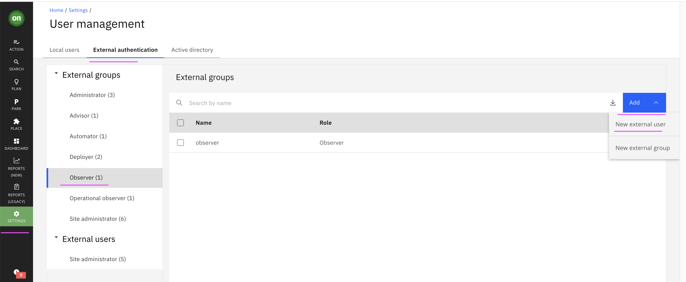
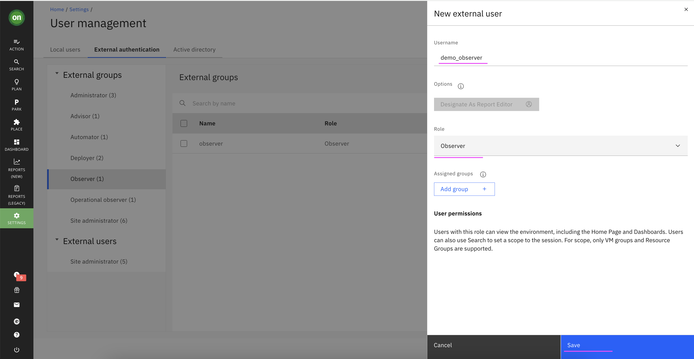
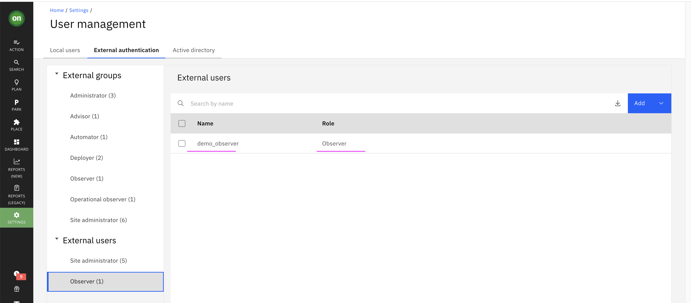
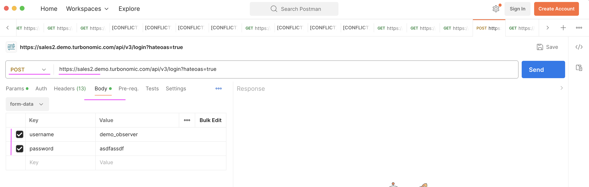
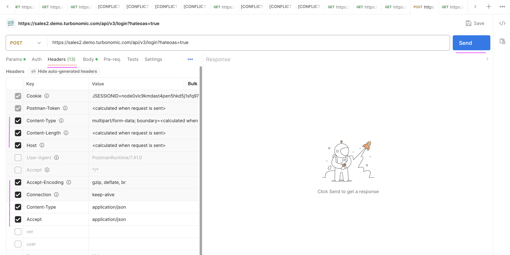
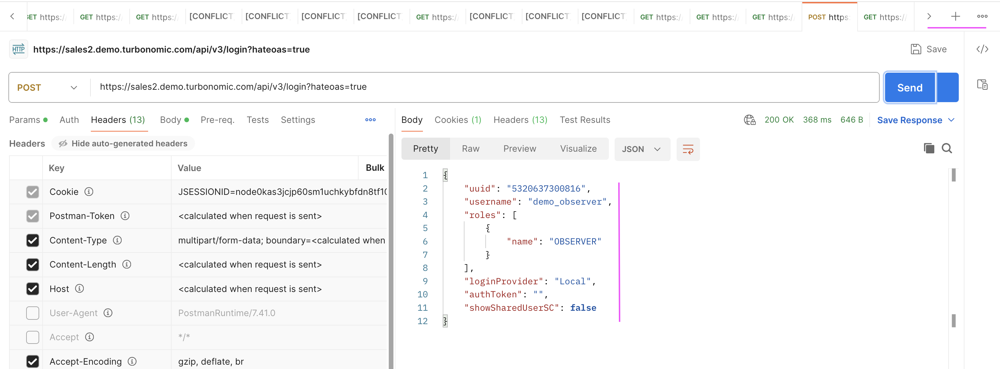
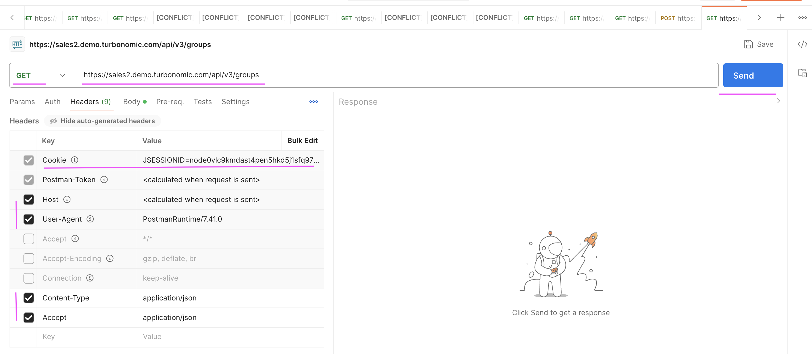
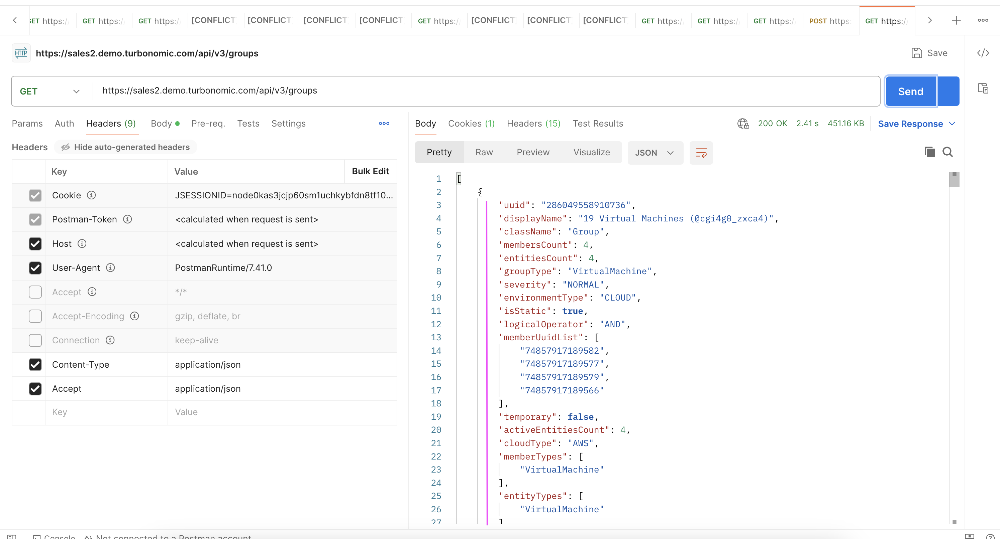

# How to use Turbonomic API in Postman

In this document let's explore about how to use Turbonomic API in the Postman.

## 1. Create Local User

1. Create a new Local user by choosing the below menu option.

`Home > SETTINGS > Local User >  New Local User`



2. User name could be `demo_observer`, give some password and choose role as `Observer`

3. Click `Save` button



4. User gets created.




## 2. Login using Postman

In the Postman do the following.

1. Choose `POST` Option

2. Give the url like this `https://sales2.demo.turbonomic.com/api/v3/login?hateoas=true` (as per your turbonomic instance)

3. In the `Body` tab, give the `username` and `password` that we created in the above step



4. In the `Headers` tab, enter the values as highlighted in the below image

5. Click `Send` button



You will get the results like this.




The curl statement of the above postman request would be like this 

```
curl --location 'https://sales2.demo.turbonomic.com/api/v3/login?hateoas=true' \
--header 'Content-Type: application/json' \
--header 'Accept: application/json' \
--form 'username="demo_observer"' \
--form 'password="adsadafdsf"'
```

As part of the above login request the Session Id with token is created with the response. This will be used in the subsequent request via post man automatically.


## 3. Call another API in the postman

In the Postman do the following.

1. Choose `GET` Option

2. Give the url like this `https://sales2.demo.turbonomic.com/api/v3/groups` (as per your turbonomic instance)

3. In the `Headers` tab, enter the values as highlighted in the below image

You can also notice the `Cookie` variable contains `JSESSIONID=nodeOvIc9kmdast4pen5hkd5j1sfq97...`, which is basically generated from the login step that we executed before. If this variable is not set by default then you can also add manually the `Cookie` variable and copy the `JSESSIONID....` from the previous POST method header section.

4. Click `Send` button




You will get the results like this.




The curl statement of the above postman request would be like this 

```
curl --location 'https://sales2.demo.turbonomic.com/api/v3/groups' \
--header 'Content-Type: application/json' \
--header 'Accept: application/json' \
--header 'Cookie: JSESSIONID=node0kas3jcjp60sm1uchkybfdn8tf10137.node0'
```


## Note: 

Reference  : https://www.ibm.com/docs/en/tarm/8.13.6?topic=reference-getting-started-turbonomic-rest-api
